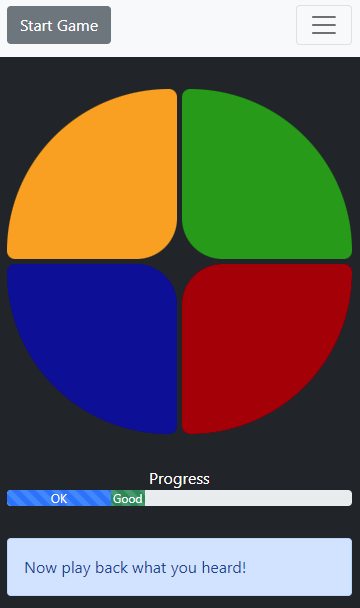

# Simple Electronic Simon Simulator

This is a simple implementation of the Electronic Simon Game

For information on the game: [Simon Wikipedia](https://en.wikipedia.org/wiki/Simon_(game))

Interesting features

* Although the board is drawn to look like the electronic simon game, it uses CSS to modify squares to produce the circular look of the application.
* The audio is created through the audio context and the oscillator node (no wav/mp3 files). It produces sounds very similar to the original electronic game.
* This abuses react-redux to update state between the navbar and the game itself.
* Uses [reactstrap](https://reactstrap.github.io/?path=/story/home-installation--page) to make the pages look a bit prettier.

This project was bootstrapped with [Create React App](https://github.com/facebook/create-react-app).

## Available Scripts

In the project directory, you can run:

### `npm start`

Runs the app in the development mode.\
Open [http://localhost:3000](http://localhost:3000) to view it in the browser.

The page will reload if you make edits.\
You will also see any lint errors in the console.

### `npm test`

Launches the test runner in the interactive watch mode.\
See the section about [running tests](https://facebook.github.io/create-react-app/docs/running-tests) for more information.

### `npm run build`

Builds the app for production to the `build` folder.\
It correctly bundles React in production mode and optimizes the build for the best performance.

The build is minified and the filenames include the hashes.\
Your app is ready to be deployed!

See the section about [deployment](https://facebook.github.io/create-react-app/docs/deployment) for more information.

## Learn More

You can learn more in the [Create React App documentation](https://facebook.github.io/create-react-app/docs/getting-started).

To learn React, check out the [React documentation](https://reactjs.org/).
