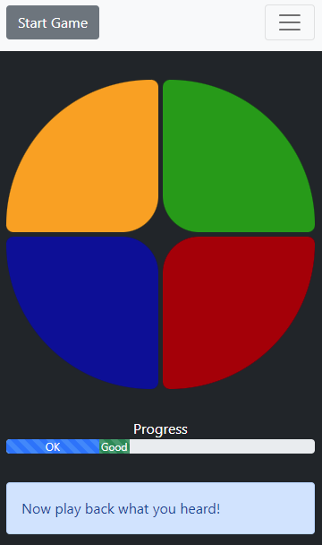

# Simple Electronic Simon Simulator

This is a simple implementation of the Electronic Simon Game

For information on the game: [Simon Wikipedia](https://en.wikipedia.org/wiki/Simon_(game))

Interesting features

* Although the board is drawn to look like the electronic simon game, it uses CSS to modify squares to produce the circular look of the application.
* The audio is created through the audio context and the oscillator node (no wav/mp3 files). It produces sounds very similar to the original electronic game.
* The game is a pure reducer (`src/game/simon.ts`) held in a small [Zustand](https://github.com/pmndrs/zustand) store shared by the navbar and the board.
* Uses [reactstrap](https://reactstrap.github.io/?path=/story/home-installation--page) to make the pages look a bit prettier.

Built with [Vite](https://vite.dev), React 19 and TypeScript.

## Available Scripts

In the project directory, you can run:

### `npm start` (or `npm run dev`)

Runs the app in development mode at [http://localhost:3000](http://localhost:3000), with hot reload.

### `npm test`

Runs the [Vitest](https://vitest.dev) suite in watch mode. Use `npx vitest run` for a single run.

### `npm run lint`

Runs ESLint.

### `npm run build`

Type-checks and builds the app for production into the `dist` folder. `npm run preview` serves the build locally.
